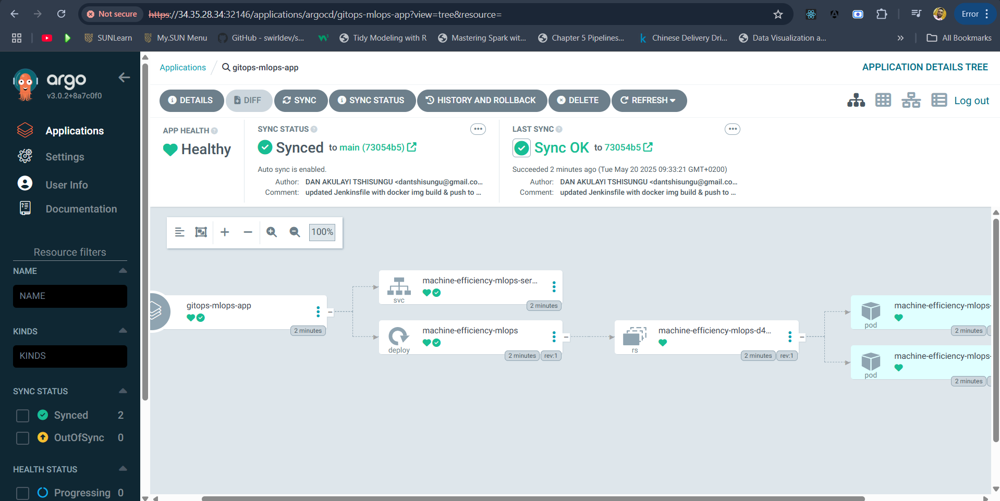

# Manufacturing machine efficiency 📈 MLOPs

A machine learning operation implementation to predict and deploy an ML-model assessing the efficiency of a manufacturing machine.

**Use cases:**
- Predicting the efficiency of a manufacturing machine.
- Cost management
- Predictive maintenance

**Technologies:**

- `github` as a version control system
- `jenkins` as a CI tool
- `argoCD` as a CD tool
- `docker` for containerization
- `kubernetes` for orchestration
- `Google Cloud` as a cloud provider with `VM` and `GKE`
- `github Webhooks` for triggering CI/CD pipelines

## Snapshots

**Docker in GCP VM:**

**argoCD in GCP VM:**

**Successful build and CI with Jenkins:**

**successful deployment with argoCD:**
